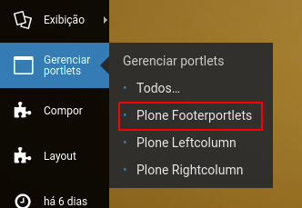

# Gestão de Conteúdo

Confira o funcionamento e conheça a forma de editar os principias elementos da interface do portal. Este manual é avançado, e espera que o usuário já possua noções de funcionamento do Plone e dos complementos do portal.
Os estilos de exemplo aqui são os estilos previstos para o tema Padrão. Em outros temas os estilos podem variar.

## 1. Cabeçalho

### 1.1 Logo e título do portal

Para alterar o Logo e titulo do portal, basta realizar a alteração na interface padrão do Plone:

1. Acesse a página de configuração do site no painel de controle do Plone. (http://0.0.0.0:8080/Plone/@@site-controlpanel);
2. Substitua a imagem atual pelo logo do seu projeto;
3. Altere o nome do seu portal;
4. Clique em Salvar.


**Resultado:**


### 1.2 Ações do Portal


As ações do Portal são baseadas em um portlet de texto, para que qualquer gestor possa alterá-lo.

1. Na raiz do site, clique em Gerenciar Portlets/Plone Footerportlets  


2. Clique em **IDGX Actions**. O HTML existente nesta página é o que aaparece no canto superior direitodo Portal. Basta editá-lo e Salvar.

**IMPORTANTE:** É necessário manter o HTML desta página correto, para evitar quebras. Sempre que possível, prefira alterar diretamente o HTML

O HTML original desta página é o seguinte:

```
<ul class="links-texto">
	<li><a href="https://idgx.dev/">IDGX</a></li>
	<li><a href="https://plone.com/">Plone</a></li>
	<li><a href="https://github.com/plonegovbr">Plonegovbr</a></li>
</ul>

<ul class="links-icones">
	<li id="siteaction-contraste">
		<a href="#" title="Alto Contraste"> 
			<i class="icon-adjust"> </i> <span>Alto Contraste</span> 
		</a>
	</li>
	<li>
		<a href="http://www.vlibras.gov.br/" title="VLibras" data-linktype="external" data-val="vlibras"> 
			<i class="demo-icon icon-asl-interpreting"> </i> <span>VLibras</span>
		</a>
	</li>
</ul>
```

Os itens da primeira lista são exibidos como texto. Os da segunda lista, são exibidos como ícones. (ver FontAwsome)


### 1.3 Redes Sociais

Os ícones sociais são baseadas em um portlet de texto, para que qualquer gestor possa alterá-lo.


1. Na raiz do site, clique em Gerenciar Portlets/Plone Footerportlets  


2. Clique em **IDGX Ícones**. O HTML existente nesta página é o que aparece no rodapé do site e abaixo do menu.

**IMPORTANTE:** É necessário manter o HTML desta página correto, para evitar quebras. Sempre que possível, prefira alterar diretamente o HTML

O HTML original desta página é o seguinte:

```
<ul>
<li><a href="https://www.twitter.com" title="Twitter"><i class="icon-twitter-squared"> </i></a></li>
<li><a href="https://www.facebook.com" title="Facebook"><i class="icon-facebook-squared"> </i></a></li>
<li><a href="https://www.youtube.com" title="Youtube"><i class="icon-youtube-squared"> </i></a></li>
</ul>
```

Para inclusão de novos ícones, basta criar um novo `<li>` com o icone da rede social correspondente. (ver FontAwsome)


### 1.4 Ícones de compartilhamento

O IDGX não utiliza nenhum complemento para os ícones de compartilhamento, mas está preparado para utilizar o [AddThis](https://www.addthis.com/) como provedor para os ícones.


Para inserir seus ícones você deve fazer o seguinte:

1. Crie uma conta no Addthis;
2. Configure seu widget e copie o código;
3. No painel de controle/configuração do site cole o código do seu widget no campo para inclusão de códigos JS. 

 

Caso tenha escolhido o widget *inline*, ele será posicionado abaixo do Título do conteúdo. Caso tenha escolhido o widget *Floating* ele será exibido da maneira que você configurou seu widget.

IMPORTANTE: Todo o controle de ícones que irão aparecer e sua aparencia são feitos diretamente no addthis.


## 2. Estilos das Capas

O Cover permite que cada tile em sua capa possa ter um ou mais estilos associados, para que esses tiles tenham uma aparência diferenciada. Para instruções de uso completas de uso do Cover, recomendamos a leitura do manual do complemento.

Os estilos definidos na configuração do portal para o Cover são os seguintes:

```
-Default-|tile-default
Blocos de itens|bloco-itens
Destaque Topo|destaque-principal
Foto Sobreposta|foto-sobreposta
Lista de itens|lista-itens
Tag Aviso|tag-aviso
Tag Comunicado|tag-comunicado
Tag Urgente|tag-urgente
Titulo de Secao|titulo-secao
```


### 2.1 Como definir uma estilo

1. Acesse a aba layout da sua capa;  

2. Clique na engrenagem do tile, linha ou coluna onde deseja aplicar o estilo; 
3. Escolha um mais estilos de acordo com o desejado;   


### 2.2 Estilos principais
Confira alguns dos estilos principais planejados e que podem ser aplicados em seu conteúdo.

#### Destaque no topo


1. Clique na engrenagem da linha que deseja mover para o topo;
2. Selecione a classe "Destaque Topo";

O conteúdo desta linha será posicionado em destaque no topo. Garanta que o tile tenha uma imagem grande para não perder qualidade.

#### Foto Sobreposta


1. Clique na engrenagem do tile que deseja modificar;
2. Selecione a classe "Foto Sobreposta";

A aparência do tile será modificado de acordo com o modelo acima.

#### Tag para noticias


1. Clique na engrenagem do tile que deseja modificar;
2. Selecione a classe "Tag Urgente";

Uma tag vermelha com a palavra em branco será aplicada acima do título do tile. Preparado para ser utilizado em tiles com notícias.

Aleém da tag Urgente, existem mais dois itens com o mesmo funcionamento. No total temos:

* Tag Aviso (amarelo)
* Tag Comunicado (verde)
* Tag Urgente (vermelho)

Essas tags não são editáveis, os textos sempre serão os mesmos.
Possível utilizar apenas uma tag por notícia.

#### Titulo da Seção


1. Clique na engrenagem do tile que deseja modificar;
2. Selecione a classe "Titulo secao";

O conteúdo do tile será exibido em formato de título, de maneira centralizada. Preparado para ser utilizado com o tile básico.

#### Blocos de itens


1. Crie um tile de texto rico com elementos dentro de DIVs;
2. Clique na engrenagem deste tile;
2. Selecione a classe "Bloco de Itens";

O conteúdo do tile será exibido em formato de cartões. Preparado para ser utilizado com o tile básico com o seguinte HTML:

```
<div>
<h4><a href="../resolveuid/428e897fdf95498cbf87cd2a2b3c739f" data-linktype="internal" data-val="428e897fdf95498cbf87cd2a2b3c739f"><i class="demo-icon icon-truck"> </i>Título do Ícone</a></h4>
<p>descrição do link</p>
</div>
```

Repita o código acima para quantos cartões achar necessário.

#### Lista de itens


1. Crie um tile de texto rico, a adicione uma lista de itens;
2. Clique na engrenagem deste tile;
2. Selecione a classe "Lista de Itens";

O conteúdo do tile será exibido em formato de cartões. Preparado para ser utilizado com o tile básico com o seguinte HTML:

```
<ul>
<li>
<a href="#">
<strong>destaque 1<br /></strong>
<span>blablabla</span>
</a>
</li>
</ul>
```

Repita o código acima para quantos itens achar necessário.